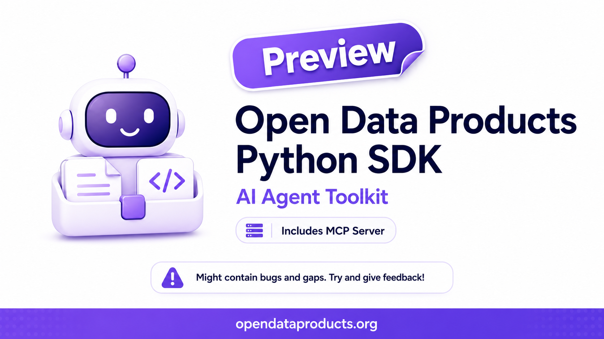

# Open Data Products Python SDK for AI Agents



[](https://badge.fury.io/py/open-data-products)
[](https://github.com/Open-Data-Product-Initiative/odps-python)
[](https://opensource.org/licenses/Apache-2.0)

An AI-agent-first Python SDK for the OpenDataProducts.org standards family. It gives agents, agent hosts, and automation systems one consistent surface for loading, detecting, validating, explaining, searching, traversing, and summarizing documents across:

* [Open Data Product Specification (ODPS)](https://opendataproducts.org/v4.1/), 
* [Open Data Product Catalog (ODPC)](https://opendataproducts.org/odpc-v1.0/), 
* [Open Data Product Graphs (ODPG)](https://opendataproducts.org/odpg-v1.0/), and
* [Open Data Product Vocabulary (ODPV)](https://opendataproducts.org/odpv-v1.0/).

The package still includes developer-facing Python helpers, but the primary contract is agent-ready: structured validation results, lightweight artifact summaries, reference discovery, bundled retrieval resources, a unified CLI, an MCP stdio server, and an ARWS agent manifest.

## AI Agent-First SDK

### Unified Agent API

Use the top-level API when building AI agents, automation, validation pipelines, or tools that need to work across the Open Data Products standards family without knowing the spec namespace ahead of time:

```python
from open_data_products import (
    explain_document,
    list_resources,
    load_document,
    resolve_references,
    validate_document,
)

document = load_document("product.yaml")
result = validate_document(document)

print(result.valid, result.spec, result.kind)
print(explain_document(document))

for reference in resolve_references(document):
    print(reference.pointer, reference.ref)

for resource in list_resources():
    print(resource.id, resource.spec, resource.type)
```

The top-level CLI exposes the same workflow with machine-readable output:

```bash
open-data-products validate product.yaml --json
open-data-products explain product.yaml --json
open-data-products refs graph.yaml --json
open-data-products resources --json
open-data-products summary product.yaml      # lightweight reference: size, hash, spec
open-data-products manifest --json           # ARWS agent manifest
open-data-products serve                     # MCP server over stdio
```

### Why Agent First

- **One cross-spec entry point**: Agents can call `load_document`, `validate_document`, `explain_document`, and `resolve_references` across ODPS, ODPC, ODPG, and ODPV files.
- **Structured outputs**: Validation, references, resources, summaries, and graph reasoning helpers return predictable objects that are easy for agents to inspect.
- **Small-context workflows**: `load_summary` returns metadata, size, hash, spec, kind, and id without returning full document bodies.
- **Retrieval-ready resources**: Bundled schemas, vocabulary records, catalog object records, and graph object records are discoverable through `list_resources` and MCP tools.
- **Graph reasoning for agents**: ODPG helpers support graph summaries, traversal, strategic analysis, and trusted focus-node context extraction.
- **Host integration**: MCP-capable tools can launch `open-data-products serve`, while ARWS-compatible systems can read the generated manifest.

### Agent Surface (MCP + ARWS)

The SDK ships a local stdio MCP (Model Context Protocol) server. MCP-capable
hosts such as Claude Code, Codex CLI, Cursor, and Gemini CLI can be configured
to launch the server and call its tools over MCP, instead of invoking SDK CLI
commands manually:

```bash
open-data-products serve
```

#### Codex and Claude Code

Project-level MCP setup is included for **Codex** and **Claude Code** so the SDK can be
used as an MCP tool surface directly from the repository:

- **Codex**: `.codex/config.toml` registers the SDK server as
  `open_data_products`.

  ```toml
  [mcp_servers.open_data_products]
  command = "open-data-products"
  args = ["serve"]
  enabled = true
  startup_timeout_sec = 10
  tool_timeout_sec = 60
  ```

- **Claude Code**: `.mcp.json` registers the same server using Claude Code's
  project-scoped MCP configuration.

  ```json
  {
    "mcpServers": {
      "open_data_products": {
        "command": "open-data-products",
        "args": ["serve"]
      }
    }
  }
  ```

Both configs are intentionally portable: they use `open-data-products serve`,
contain no local absolute paths, and assume `open-data-products` is available
on `PATH`. Install the package in the active environment first with
`pip install -e .` or install the published package before expecting an agent
host to launch the server.

The same tool set (`validate_document`, `explain_document`,
`resolve_references`, `list_resources`, `get_resource`, `load_summary`,
`search_terms`, `search_objects`, `search_graph_objects`, `summarize_graph`,
`traverse_graph`, `analyze_graph`, `agent_context`) is also exposed as an
[ARWS](https://agenticpatterns.veso.ai/arws) agent manifest:

```bash
open-data-products manifest --json
```

Three [agent skills](https://agenticpatterns.veso.ai/skills) under
`skills/` (`odp-validate`, `odp-author`, `odp-explore-graph`) wrap the
common workflows for hosts that auto-load `SKILL.md` bundles.

## Package Structure

Use `open_data_products.<spec>` namespaces for every standard:

| Namespace | Standard | Status |
|-----------|----------|--------|
| `open_data_products.odps` | Open Data Product Specification | Implemented |
| `open_data_products.odpc` | Open Data Product Catalog | Catalog helpers implemented |
| `open_data_products.odpg` | Open Data Product Graph | Graph helpers implemented |
| `open_data_products.odpv` | Open Data Product Vocabulary | Vocabulary tools implemented |

## Capabilities at a Glance

| Area | What agents and developers can do |
|------|-----------------------------------|
| Cross-spec API | Detect, load, validate, explain, summarize, and resolve references across ODPS, ODPC, ODPG, and ODPV |
| MCP + ARWS | Run a local stdio MCP server, expose safe tools, and generate an ARWS agent manifest |
| ODPS | Create, load, validate, serialize, and inspect ODPS v4.1 data product documents |
| ODPC | Validate catalogs, explain catalog metadata, and search bundled catalog object guidance |
| ODPG | Validate graphs, summarize nodes and edges, traverse relationships, analyze governance/strategy signals, and extract agent context |
| ODPV | Load, validate, search, and generate vocabulary artifacts for shared ODP terminology |
| Bundled resources | Discover schemas, examples, vocabulary records, catalog object records, and graph object records through the resource registry |

ODPS field validation includes ISO language, country, currency, date/time,
phone, email, and URI formats where those standards apply.

## Installation

```bash
pip install open-data-products

# For development:
pip install "open-data-products[dev]"
```

## Usage Guide

This README is intentionally a short landing page. Use the focused references
below for implementation details:

- [API reference](docs/API.md): ODPS models, validators, serialization, and examples.
- [Example scripts](examples/): runnable ODPS examples, including v4.1 strategy and MCP access examples.
- [Sample apps](apps/README.md): independent CLIs built on top of the SDK.
- [Agent handoff](llms.txt): compact machine-readable routing for AI agents.

### Common Workflows

```bash
# Cross-spec validation and summaries
open-data-products validate product.yaml --json
open-data-products explain catalog.yaml --json
open-data-products refs graph.yaml --json
open-data-products summary product.yaml

# Bundled agent resources
open-data-products resources --json
open-data-products resources --id odpv.terms --json
open-data-products resources --id odpg.objects --json

# ODPG graph reasoning
open-data-products odpg-summary graph.yaml
open-data-products odpg-traverse graph.yaml --start AGENT-001 --depth 2
open-data-products odpg-analyze graph.yaml
open-data-products odpg-agent-context graph.yaml --node AGENT-001 --depth 2
```

### Spec-Specific Entry Points

- `open_data_products.odps`: ODPS v4.1 models, standards-aware validation, YAML/JSON I/O, compliance helpers, and `pricing_to_402`.
- `open_data_products.odpc`: ODPC catalog loading, validation, explanation, and object guidance search.
- `open_data_products.odpg`: ODPG graph validation, summary, traversal, analysis, agent context, object search, and graph explorer generation.
- `open_data_products.odpv`: ODPV vocabulary loading, validation, search, and generated vocabulary artifacts.

## Development

```bash
git clone https://github.com/Open-Data-Product-Initiative/odps-python
cd odps-python
pip install -e ".[dev]"
python examples/basic_usage.py
```

### Dependencies

The library requires the following runtime packages:
- `PyYAML`: YAML format support
- `jsonschema`: ODPC and ODPG schema validation

## Error Handling

The library provides detailed validation error messages that reference specific standards:

```python
try:
    odp.validate()
except ODPSValidationError as e:
    print(e)
    # Output: "Validation errors: Invalid ISO 639-1 language code: 'xyz'; 
    #          dataHolder email must be a valid RFC 5322 email address"
```

## Examples

### ODPS v4.1 Example
See [examples/odps_v41_example.py](examples/odps_v41_example.py) for a demonstration of key v4.1 features including:
- ProductStrategy with business objectives
- KPI definitions with targets and calculations
- AI agent integration via MCP
- Enhanced $ref support

Run the example:
```bash
python examples/odps_v41_example.py
```

### Additional Examples
- [Basic ODPS Creation](examples/basic_usage.py)
- [Comprehensive ODPS Document](examples/comprehensive_example.py)
- [Advanced Features](examples/advanced_features.py)

### Sample Apps
The [apps/](apps/README.md) folder contains independent, runnable Python
sample apps built on top of the SDK. Each app lives in its own folder with a
`cli.py` entry point and can be run directly from the repository root.

- [ODP Document Inspector CLI](apps/document_inspector/cli.py): inspect any ODPS, ODPC, ODPG, or ODPV YAML/JSON document and print validation, explanation, references, and bundled resource metadata.
- [ODPV Vocabulary Finder CLI](apps/vocabulary_finder/cli.py): search bundled ODPV terms by natural-language query and print definitions, scores, matched fields, and related terms.
- [ODPS Pricing 402 Builder CLI](apps/pricing_402_builder/cli.py): build an HTTP 402 payment envelope from an ODPS product with pricing plans.

```bash
python3 apps/document_inspector/cli.py apps/pricing_402_builder/priced_product.yaml
python3 apps/vocabulary_finder/cli.py "governance policy risk" --limit 5 --json
python3 apps/pricing_402_builder/cli.py apps/pricing_402_builder/priced_product.yaml --json
```

## Acknowledgments

We extend our gratitude to the following:

**[Open Data Product Initiative Team](https://opendataproducts.org/)** - Special thanks to the team at opendataproducts.org for creating and maintaining the emerging Open Data Product standards family, including the Open Data Product Specification (ODPS), Open Data Product Catalog (ODPC), Open Data Product Graphs (ODPG), and Open Data Product Vocabulary (ODPV). Their vision of standardizing data product descriptions, catalogs, graphs, and shared vocabulary has made this SDK possible. These specifications represent years of collaborative effort from industry experts, data practitioners, and open source contributors who are driving the future of data standardization.

**[Chris Howard / Kitard](https://github.com/Kitard)** - Special thanks to Chris Howard from Accenture for creating the original `odps-python` library. His foundational work made it possible to extend the project into the broader Open Data Products SDK and agent toolkit.

**[devlouie](https://github.com/devlouie)** - Special thanks to devlouie for contributing the MCP layer and Agent Surface on top of the SDK, helping make the Open Data Products standards family easier to use from agentic tools and workflows.

**Python Community** - For the exceptional ecosystem of libraries and tools that power this implementation, including PyYAML, jsonschema, and the countless other packages that make Python development a joy.

**Data Community** - For embracing open standards and driving the need for better data product specifications and tooling that benefits everyone in the data ecosystem.

**Documentation Support** - Documentation assistance provided by Claude (Anthropic).

## Contributing

Contributions are welcome. Please read CONTRIBUTING.md for guidelines, browse
the [open issues](https://github.com/Open-Data-Product-Initiative/odp-agent-sdk/issues),
and consider helping with new features, bug fixes, examples, documentation, or
agent-facing workflow improvements.

## License

Apache License 2.0 - see LICENSE file for details.

## Links & References

- [Open Data Product Specification v4.1](https://opendataproducts.org/v4.1/)
- [ODPS Schema](https://opendataproducts.org/v4.1/schema/)
- [Open Data Product Catalog (ODPC)](https://opendataproducts.org/odpc-v1.0/) 
- [Open Data Product Graphs (ODPG)](https://opendataproducts.org/odpg-v1.0/) 
- [Open Data Product Vocabulary (ODPV)](https://opendataproducts.org/odpv-v1.0/) 
- [Open Data Product Standards Knowledge Base](https://opendataproducts.org/howto) 
- [ISO 639-1 Language Codes](https://en.wikipedia.org/wiki/List_of_ISO_639-1_codes)
- [ISO 3166-1 Country Codes](https://en.wikipedia.org/wiki/ISO_3166-1_alpha-2)
- [ISO 4217 Currency Codes](https://en.wikipedia.org/wiki/ISO_4217)
- [ISO 8601 Date/Time Format](https://en.wikipedia.org/wiki/ISO_8601)
- [E.164 Phone Number Format](https://en.wikipedia.org/wiki/E.164)
- [RFC 5322 Email Format](https://datatracker.ietf.org/doc/html/rfc5322)
- [RFC 3986 URI Format](https://datatracker.ietf.org/doc/html/rfc3986)
