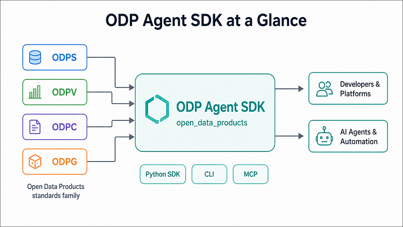
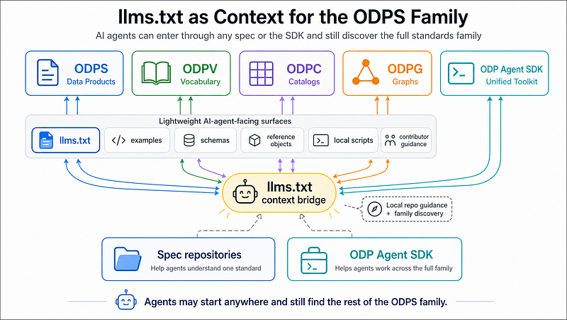
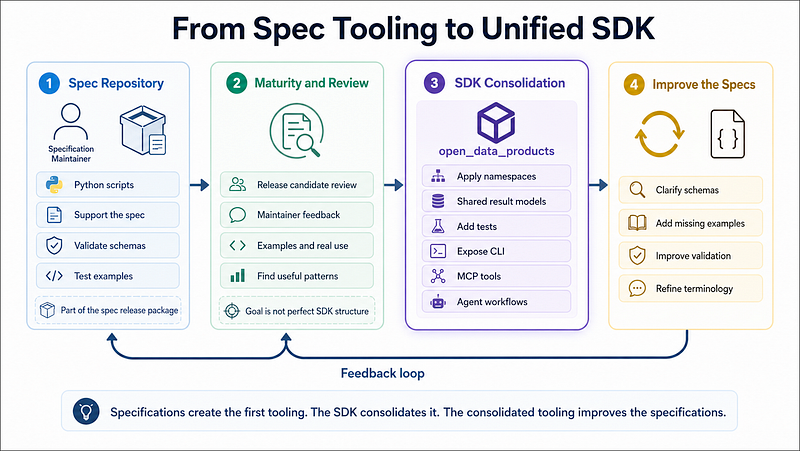

# Why ODPS Family Tooling Starts in the Specs and Consolidates in the SDK

The ODP Agent SDK is the consolidated Python toolkit for the Open Data Products standards family. It brings ODPS, ODPV, ODPC, and ODPG into one package called `open_data_products`, giving developers, platforms, automation workflows, and AI agents one consistent interface for working with the family.

The SDK is built with an AI Agent First mindset. It is not only a developer library. It is designed so AI agents can load standards documents, detect document types, validate files, explain structures, search artifacts, traverse relationships, summarize content, and use the standards family through CLI and MCP interfaces.

In practice, it becomes the toolkit for creating, validating, explaining, traversing, and manipulating Open Data Products standards across ODPS, ODPC, ODPG, and ODPV.

This matters because the ODPS family is no longer only one specification.

- ODPS defines the data product itself.
- ODPV provides the shared vocabulary.
- ODPC adds the catalog and portfolio layer.
- ODPG adds the graph and relationship layer.

Each standard is useful on its own, but real value appears when they work together. Without a consolidated SDK, that cross-spec work would be harder to implement, automate, and expose to AI agents.

The SDK is where the family becomes operational. It provides the shared package structure, public APIs, CLI commands, MCP tools, validation results, bundled resources, summaries, examples, tests, and spec-specific namespaces. It gives humans and AI agents one practical entry point into the full standards family.

This does not mean the SDK replaces spec-level tooling. It consolidates it. Useful scripts and patterns first emerge inside each specification repository, where the subject matter expertise lives. The SDK then turns the proven parts into a stable, unified toolkit for cross-spec work.

AI Agent First standards need more than documents. They need schemas, examples, scripts, guidance, and tool surfaces that AI agents can use in real workflows. For the ODPS family, the right model is not to force all tooling into one central SDK from the beginning. The better model is to let tooling start inside each specification repository and then consolidate the proven parts into the ODP Agent SDK.

This gives the standards family both speed and structure. Specification maintainers can move fast in their own domain, while the SDK creates one coherent toolkit for developers, platforms, automation workflows, and AI agents.

## Why tooling starts inside each specification

Each specification in the ODPS family has its own area of expertise. ODPS defines data products. ODPV defines the shared vocabulary. ODPC defines catalog and portfolio objects. ODPG defines graph relationships and reasoning structures.

The maintainers of these specifications understand their own domain best. They know the intended structure, the important examples, the difficult edge cases, and the validation logic that makes the specification useful in practice. That is why Python scripts should first be developed in the context of each specification.

This keeps tooling close to the source of meaning. A vocabulary maintainer should be able to create a vocabulary checker inside the ODPV repository. A graph maintainer should be able to create traversal or validation helpers inside the ODPG repository. A catalog maintainer should be able to test catalog patterns inside the ODPC repository before those patterns are promoted into shared tooling.

This is not fragmentation. It is a practical way to let subject matter expertise shape the first version of the tooling.

## What each specification release should deliver

Each specification release should stand on its own. It should deliver the specification, but also enough supporting material to make the specification understandable, testable, and usable.

That package should include the specification document, schemas, examples, reference objects, Python scripts, `llms.txt` files, contributor guidance, and GitHub-based feedback paths. These assets make the specification easier to review and easier to implement.

The Python scripts in this context are not meant to be a polished SDK. They are part of the spec delivery package. They help prove that the specification works. They support validation, examples, local checks, artifact generation, and early implementation learning.

The lightweight AI-agent-facing files have the same purpose. An `llms.txt` file helps an AI agent understand how to work with the repository. Examples show the patterns the agent should follow. Schemas define the boundaries. Scripts give executable reference behavior.

Together, these assets make each specification more than a static document. They make it implementation-friendly and agent-readable.

## Why the SDK has a different role

The ODP Agent SDK has a different job. It is not a replacement for spec-level tooling. It is the consolidation layer for the full standards family.

The SDK takes useful patterns from the specification repositories and turns them into one coherent Python package called `open_data_products`. This package provides the stable developer and agent surface for the whole family.

That means the SDK handles the parts that should be consistent across the standards family. It provides a unified public API, cross-spec loading and detection, shared validation results, lightweight summaries, reference helpers, a unified CLI, MCP server support, agent manifest generation, bundled resources, tests, examples, and spec-specific namespaces.

This is where tooling becomes product-grade. Scripts that began as practical helpers inside a spec repository can later be normalized, renamed, tested, documented, and exposed through stable SDK interfaces.

## The difference between spec scripts and SDK tooling

Spec-level scripts and SDK tooling should not be confused. Spec-level scripts exist close to the specification. They can be practical, local, and shaped by the needs of one repository. Their file names can be simple. Their structure can be different from the SDK. They should help the maintainer validate the specification, test examples, and support the release package.

The SDK is where unification happens. It applies the package structure, namespaces, shared result models, CLI behavior, MCP tools, and cross-spec workflows.

This distinction is important because the scripts inside each spec context do not need to follow the SDK namespaces from day one. Forcing that too early would slow down spec development and create unnecessary coordination overhead. The spec repository should stay close to the maintainer's domain. The SDK should turn mature patterns into a stable toolkit.

The clean rule is this: spec scripts prove the standard, the SDK productizes the tooling.

## How the SDK should be structured

The SDK should be a single Python package, `open_data_products`, with one unified agent-facing layer plus spec-specific namespaces.

The top-level package should expose the public API and shared utilities. Files such as `agent.py`, `cli.py`, `summary.py`, `resources.py`, `results.py`, and `pricing.py` provide cross-spec capabilities. These functions help agents and developers load, detect, validate, explain, summarize, inspect resources, return shared results, and handle specific cross-cutting needs such as ODPS pricing plans.

The MCP and agent surface should live inside the SDK as well. The SDK should include MCP tool handlers, an agent manifest generator, and an MCP server. This is the right place for deeper AI-agent integration because it works across the full standards family rather than only one specification.

The spec-specific namespaces should preserve domain logic.

- The ODPS namespace should handle ODPS models, validation, codecs, protocols, exceptions, and schema data.
- The ODPC namespace should handle catalog loading, validation, explanation, object search, and bundled catalog resources.
- The ODPG namespace should handle graph loading, validation, traversal, analysis, agent context, graph explorer generation, and bundled graph objects.
- The ODPV namespace should handle vocabulary loading, validation, search, artifact generation, and bundled vocabulary files.

This structure gives the SDK one coherent package while still respecting the differences between the specifications.

## Why this avoids bottlenecks and fragmentation

If all tooling started only in the SDK, the SDK maintainer would become a bottleneck. Every validation helper, loader, graph utility, vocabulary checker, and catalog script would need central coordination before it could exist. That would slow down the specification work and move tooling away from the people who best understand the domain.

If all tooling stayed only inside the specification repositories, the family would become fragmented. Each repository would have its own script names, output formats, assumptions, conventions, and usage patterns. Developers and AI agents would need to learn every repository separately. Cross-spec workflows would become harder.

The two-layer model avoids both problems. The spec repositories move fast because maintainers create tooling where the expertise lives. The SDK creates consistency because it consolidates the useful parts into one package, one CLI, one MCP surface, and one agent-facing toolkit.

This is a good fit for a standards family with multiple maintainers.

## The role of AI-agent-facing files in the spec repositories

Each specification repository should include lightweight AI-agent-facing surfaces. These files help agents understand the repository and work with the specification.

That includes `llms.txt` files, contributor instructions, examples, schemas, reference objects, and local scripts. These assets are valuable because they help AI agents navigate the repository, understand the purpose of files and tooling, follow contribution rules, and use the specification correctly.

The `llms.txt` files have an especially important role. They are not only local repository guides. They also act as context bridges for the full ODPS family. Each `llms.txt` file should explain the local specification, but it should also point to the other specifications in the family and to the ODP Agent SDK.

This means an AI agent does not need to start in the right repository. It might enter through ODPS because it is validating a data product, through ODPV because it is checking terminology, through ODPC because it is working with catalog objects, through ODPG because it is analyzing relationships, or through the SDK because it needs tooling. From any of these entry points, the agent should still be able to discover the other parts of the standards family.

In that sense, `llms.txt` files become part of the family-level context layer in the eyes of AI agents. They help the agent understand where it is, what the current specification does, how it relates to the rest of the family, and when the consolidated SDK should be used instead of local scripts.

These surfaces are intentionally lightweight. They are not the same thing as the SDK.

A spec repository helps an AI agent understand one standard and discover the wider family. The SDK helps an AI agent work across the full standards family through one consolidated toolkit. That difference should stay clear.

## The development flow

The development flow should be simple. First, the spec maintainer develops scripts inside the specification repository as part of the release package. These scripts support the spec, test examples, validate schemas, and capture subject matter expertise.

Then the scripts mature through release candidate review, maintainer feedback, examples, and real use. During this phase, the goal is not perfect SDK structure. The goal is to prove which scripts are useful and which patterns matter.

After that, the SDK consolidates the useful parts. It adapts the logic into the `open_data_products` package, applies namespaces, creates shared result models, adds tests, exposes CLI commands, and makes the functions available to MCP tools and agent workflows.

Finally, lessons from the SDK can flow back to the specification repositories. If the SDK reveals unclear schema design, missing examples, weak validation rules, or confusing terminology, those findings should improve the specs.

This creates a useful feedback loop. The specifications create the first tooling. The SDK consolidates the tooling. The consolidated tooling then helps improve the specifications.

## What this means for maintainers

This model respects the role of maintainers. Spec maintainers remain responsible for the meaning of their standards. They own the semantics, examples, schemas, reference objects, and first version of scripts. They are not forced to wait for a central SDK structure before they can make their specification useful.

The SDK maintainer owns the unified implementation layer. That means consistency, packaging, shared APIs, CLI behavior, MCP integration, agent-facing workflows, tests, and release quality.

This division of responsibility is practical. It lets each maintainer contribute where they have the most knowledge, while the SDK creates a common experience for users.

## The bigger point

The ODPS family is moving toward AI Agent First data product standards. That requires a balance between local expertise and unified tooling.

The specification repositories are where meaning lives. They should deliver the spec, schemas, examples, reference objects, Python scripts, `llms.txt` files, and lightweight AI-agent guidance.

The ODP Agent SDK is where the family comes together. It should consolidate mature patterns into the `open_data_products` Python package, with a unified agent-facing layer, spec-specific namespaces, CLI, MCP tools, bundled resources, shared result models, examples, tests, and reusable agent workflows.

This is the operating model. Tooling starts where the meaning lives, and unification happens where the standards family comes together.
